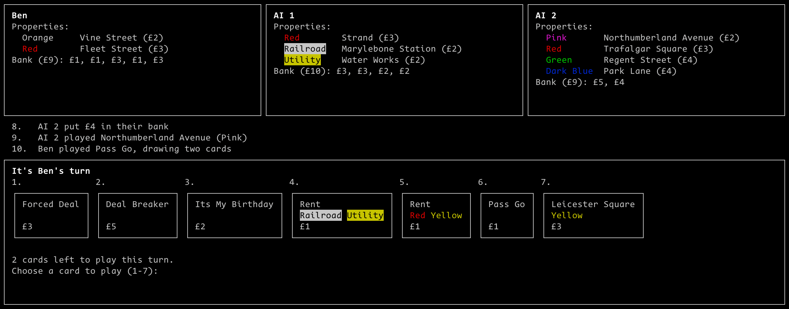

# Nullopoly

Terminal implementation of the Monopoly Deal card game, playing locally or with multiple players over the network.



## Rules

The game rules are [here](https://monopolydealrules.com), however there are some changes in this implementation:
- There are no *Just Say No* cards
- You must play three cards on your turn, you cannot skip

## Running

Requires Python 3.12+, and [curses](https://docs.python.org/3/library/curses.html).

Run locally with:
```sh
python local.py --players Alice Bob --n-ais 1
```

Or, run the `client.py` and `server.py` scripts to play over the network:

```sh
 python server.py --n-players 1 --n-ais 2 --host 127.0.0.1 --port 54321
```

and in a different terminal

```sh
python client.py --name Alice --host 127.0.0.1 --port 54321
```

The game will start when `--n-players` have connected.
